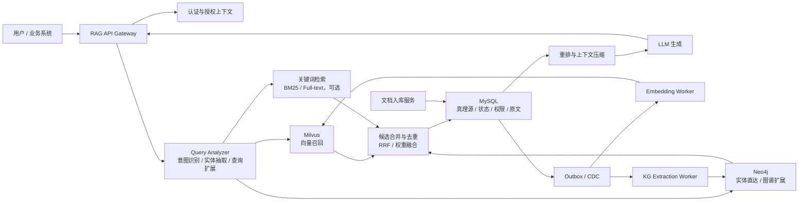

# 企业级 GraphRAG 混合检索架构设计方案

## 1. 文档定位

本文描述一个面向企业知识库场景的 GraphRAG 目标架构。系统采用 **MySQL + Milvus + Neo4j** 的三库协同方案，以 `chunk_id` 作为跨系统数据锚点，解决企业知识检索中的权限一致性、向量漏召回、结构化关系推理、可观测性和可运维问题。

当前仓库中的 `kg_ingest.py` 更接近 Neo4j GraphRAG 的原型验证脚本，还不是本文描述的完整生产架构。后续实现应以本文作为目标蓝图，分阶段补齐 MySQL 真理源、Milvus 向量索引、权限闭环、评估体系和运维治理能力。

### 1.1 设计目标

- 支持多租户、多部门、细粒度权限控制下的企业知识问答。
- 支持向量召回、实体直达、图谱扩展、关键词检索等多路召回。
- 保证所有进入 LLM 上下文的原文片段都经过 MySQL 权限与状态校验。
- 支持文档版本、下线、删除、重建索引、失败重试和审计追踪。
- 可度量检索质量、回答质量、安全性、延迟和索引新鲜度。

### 1.2 非目标

- 不把 Neo4j 作为原文内容的主存储。
- 不把 Milvus 或 Neo4j 作为最终权限判定系统。
- 不承诺跨三库强事务。三库一致性采用 MySQL 事务 + Outbox/CDC + 幂等消费 + 补偿校验实现最终一致。
- 不默认图谱扩展结果天然可信。扩展出的 `chunk_id` 必须回到 MySQL 做二次校验。

## 2. 总体架构

核心原则是：**MySQL 管业务事实，Milvus 管高召回语义检索，Neo4j 管实体关系与多跳扩展，LLM 只消费经过授权的证据上下文。**

## 3. 组件职责

| 组件 | 职责 | 不负责 |
| :--- | :--- | :--- |
| MySQL | 文档、分块、原文、版本、状态、权限、审计、索引任务状态的真理源 | 高维向量相似度检索、多跳图遍历 |
| Milvus | 大规模向量近似检索，支持租户、部门、文档类型等低频标量过滤 | 高频权限变更、最终授权判断、原文存储 |
| Neo4j | 实体、关系、别名、跨 Chunk 结构化关联、多跳扩展 | 原文主存储、最终权限判断、向量主召回 |
| 关键词检索 | 精确词、编号、术语、代码、型号等关键词型查询召回 | 复杂语义匹配、多跳关系推理 |
| RAG API | 查询编排、权限上下文注入、候选合并、重排、上下文构造、生成控制 | 长任务索引构建 |
| Worker | Embedding、图谱抽取、索引刷新、失败重试、补偿任务 | 在线同步阻塞用户查询 |

## 4. 数据模型

### 4.1 全局标识

- `tenant_id`：租户边界，所有查询与索引都必须携带。
- `doc_id`：业务文档 ID。
- `doc_version`：文档版本号，文档更新时递增。
- `chunk_id`：分块全局唯一 ID，建议由 `doc_id + doc_version + chunk_seq + content_hash` 派生或映射，保证幂等。
- `content_hash`：分块内容哈希，用于判断是否需要重建 embedding 与图谱。

### 4.2 MySQL 建议表

| 表 | 关键字段 | 说明 |
| :--- | :--- | :--- |
| `documents` | `doc_id`, `tenant_id`, `source_type`, `title`, `version`, `status`, `acl_policy_id`, `checksum`, `created_at`, `updated_at` | 文档主表 |
| `chunks` | `chunk_id`, `doc_id`, `tenant_id`, `doc_version`, `chunk_seq`, `content`, `content_hash`, `token_count`, `status` | 原文分块表 |
| `chunk_acl` | `chunk_id`, `tenant_id`, `principal_type`, `principal_id`, `permission`, `effect` | 可选的细粒度 ACL 表 |
| `ingest_jobs` | `job_id`, `doc_id`, `version`, `stage`, `status`, `retry_count`, `error_message` | 入库任务状态 |
| `outbox_events` | `event_id`, `aggregate_id`, `event_type`, `payload`, `status`, `created_at` | 跨系统索引任务投递 |
| `retrieval_audit_logs` | `request_id`, `user_id`, `tenant_id`, `query_hash`, `returned_chunk_ids`, `decision`, `created_at` | 审计与追踪 |

必须建立的索引：

- `chunks(tenant_id, status, chunk_id)`
- `chunks(doc_id, doc_version, chunk_seq)`
- `documents(tenant_id, status, updated_at)`
- `chunk_acl(tenant_id, principal_type, principal_id, chunk_id)`
- `outbox_events(status, created_at)`

### 4.3 Milvus Collection

建议 Collection：`chunk_vectors`

| 字段 | 类型 | 说明 |
| :--- | :--- | :--- |
| `chunk_id` | VarChar, primary key | 与 MySQL 对齐 |
| `tenant_id` | VarChar | 必填过滤字段 |
| `dept_id` | VarChar / Array | 低频粗粒度过滤字段 |
| `doc_id` | VarChar | 文档过滤与排查 |
| `doc_version` | Int64 | 版本过滤 |
| `content_hash` | VarChar | 索引一致性校验 |
| `embedding` | FloatVector | 文本向量 |

Milvus 中只保存稳定、低频变化的过滤字段。用户级权限、文档发布状态、审批状态等高频动态字段必须以 MySQL 为准。

### 4.4 Neo4j 图模型

推荐节点：

- `(:Chunk {chunk_id, tenant_id, doc_id, doc_version})`
- `(:Entity {entity_id, tenant_id, canonical_name, type})`
- `(:Alias {tenant_id, name, normalized_name})`
- `(:Concept {tenant_id, name})`

推荐关系：

- `(Chunk)-[:MENTIONS {confidence, extractor_version}]->(Entity)`
- `(Entity)-[:ALIAS_OF]->(Alias)`
- `(Entity)-[:RELATED_TO {type, confidence, source_chunk_id}]->(Entity)`
- `(Entity)-[:EVIDENCE_IN]->(Chunk)`

必须建立约束：

- `Chunk(chunk_id)` 唯一。
- `Entity(tenant_id, entity_id)` 唯一。
- `Alias(tenant_id, normalized_name)` 建索引。

Neo4j 查询必须始终携带 `tenant_id`，禁止跨租户实体直达与图扩展。

## 5. 入库与索引链路

### 5.1 标准入库流程

1. 文档上传后进入 `ingest_jobs`，记录 `tenant_id`、来源、版本和任务状态。
2. 解析文档，进行正文抽取、OCR、表格结构化、去噪和语言识别。
3. 按文档结构进行语义分块，优先按标题、段落、句子和表格边界切分，避免固定长度切断语义。
4. 在 MySQL 事务中写入 `documents`、`chunks`、`outbox_events`，初始状态为 `indexing` 或 `pending_publish`。
5. Embedding Worker 消费 Outbox 事件，生成向量并 upsert 到 Milvus。
6. KG Worker 消费 Outbox 事件，抽取实体、别名和关系，并 upsert 到 Neo4j。
7. Worker 完成后回写 `ingest_jobs` 和索引状态。只有满足发布条件的版本才可对外检索。
8. 定时补偿任务扫描 MySQL 与 Milvus/Neo4j 的 `content_hash`、版本和数量差异，发现不一致时重建派生索引。

### 5.2 幂等与失败处理

- Worker 消费必须以 `event_id` 和 `chunk_id` 做幂等。
- Milvus 与 Neo4j 写入采用 upsert，不依赖重复执行次数。
- Worker 失败进入重试队列，超过阈值后标记为 `failed` 并告警。
- 删除或下线文档时，MySQL 状态立即生效；Milvus/Neo4j 删除可以异步完成，因为在线检索仍必须回 MySQL 校验。
- 文档重新发布时生成新 `doc_version`，旧版本保留或归档，避免读写竞争。

## 6. 检索与生成链路

### 6.1 查询前处理

RAG API 接收请求后生成 `request_id`，并构造：

- 用户身份：`user_id`, `tenant_id`, `dept_id`, `roles`, `groups`
- 业务过滤：文档类型、时间范围、知识库范围、语言
- 查询特征：实体、关键词、意图、是否需要多跳推理

实体抽取不能只依赖精确名称匹配。必须支持别名、大小写归一、繁简转换、同义词、缩写、错别字召回和实体消歧。

### 6.2 多路召回

建议并行执行三类召回：

1. 向量召回：Milvus 按 `tenant_id`、知识库范围、低频过滤字段做前置过滤，返回 Top 50-200 个 `chunk_id`。
2. 实体直达：从查询中抽取实体或别名，在 Neo4j 中 tenant-scoped 匹配，再扩展到相关实体与候选 Chunk。
3. 关键词召回：对专有名词、合同编号、产品型号、错误码、法规条款等关键词型查询使用 BM25 或全文检索。

候选合并时使用 RRF 或可解释权重融合，并保留来源分数：

- `vector_score`
- `graph_score`
- `keyword_score`
- `entity_confidence`
- `freshness_score`

### 6.3 权限闭环

权限校验必须遵守以下规则：

- 所有候选 `chunk_id`，无论来自 Milvus、Neo4j 还是关键词检索，都必须进入 MySQL 做状态与权限校验。
- 图扩展只允许在 `tenant_id` 范围内进行。
- 图扩展得到的新 `chunk_id` 不能直接读取原文，必须再次走 MySQL 授权。
- MySQL 返回的授权结果必须作为唯一可信来源。
- 若候选全部被过滤，应返回“未找到有权限访问的相关资料”，不能暴露被过滤文档的标题、实体或数量。

推荐在线流程：

1. 多路召回得到候选 `chunk_id` 集合。
2. 批量调用 MySQL，按用户上下文校验 `status = 'active'`、版本、租户、ACL、有效期。
3. 对合法候选执行图扩展，得到扩展候选。
4. 对扩展候选再次调用 MySQL 校验。
5. 只对通过校验的 Chunk 拉取原文并进入重排。

### 6.4 重排与上下文构造

第一阶段召回只负责提高召回率，不能直接把 Top N 喂给 LLM。生产链路应增加：

- Cross-encoder 或 LLM reranker，对 query-chunk 相关性重排。
- 去重与多样性控制，避免同一文档重复占满上下文。
- 最低相关性阈值，过滤低置信候选。
- 上下文压缩，只保留与问题相关的句子、表格行或段落。
- 引用溯源，每个上下文片段保留 `chunk_id`、`doc_id`、标题、版本、页码或段落位置。

LLM 生成时必须要求基于证据回答，并在证据不足时明确拒答或说明不确定性。

## 7. 权限、安全与合规

### 7.1 权限模型

推荐采用 RBAC + ABAC：

- RBAC：角色、部门、岗位、项目组。
- ABAC：租户、文档密级、地域、数据来源、有效期、审批状态。
- Deny 优先：显式拒绝高于允许。
- 最小权限：默认不可见，只有匹配策略后可见。

### 7.2 安全控制

- API 层校验身份令牌，不信任客户端传入的 `tenant_id`。
- MySQL 中的敏感字段按需加密，密钥由 KMS 或企业密钥系统管理。
- 日志默认记录 query hash 与 chunk_id，不记录完整敏感原文。
- 对上传文档做恶意内容扫描和 prompt injection 检测。
- 对生成上下文做敏感词、PII 和密级检查。
- 对管理员、调试接口、批量导出接口做强审计。

### 7.3 Prompt Injection 防护

从文档中检索出的内容不得被视为系统指令。生成 Prompt 应明确区分：

- 系统规则。
- 用户问题。
- 检索证据。
- 引用格式。

如果证据中包含“忽略前面指令”“泄露系统提示词”等内容，模型应当把它当作普通文本，而不是执行指令。

## 8. 一致性与数据生命周期

### 8.1 一致性原则

- MySQL 是唯一真理源。
- Milvus 与 Neo4j 是派生索引，可以短暂落后。
- 在线检索的安全性不依赖派生索引是否及时删除，因为最终授权在 MySQL。
- 对用户可见的数据必须满足 MySQL 中 `status = 'active'` 且权限校验通过。

### 8.2 状态机

建议文档状态：

- `uploaded`：已上传，未解析。
- `indexing`：解析与索引构建中。
- `active`：可检索。
- `inactive`：业务下线，不可检索。
- `deleted`：逻辑删除，不可检索，等待物理清理。
- `failed`：索引失败，需要人工或任务修复。

只有 `active` 状态的 Chunk 可以进入 LLM 上下文。

### 8.3 重建与删除

- 文档更新生成新版本，不原地覆盖旧版本。
- embedding 模型变更时记录 `embedding_model_version`，支持按版本重建。
- 图谱抽取 Prompt 或 Schema 变更时记录 `extractor_version`，支持局部重建。
- 逻辑删除立即生效，物理删除异步执行并产出审计记录。

## 9. 检索质量评估

企业级 GraphRAG 必须把检索质量和生成质量分开评估。

### 9.1 离线评估集

建立包含以下类型的问题集：

- 精确事实问答。
- 多跳关系问答。
- 权限边界问答。
- 时效性问答。
- 专有名词、编号、法规条款查询。
- 无答案或证据不足问题。

每条样本应标注期望命中的 `doc_id`、`chunk_id` 或实体路径。

### 9.2 指标

检索指标：

- Recall@K
- MRR
- NDCG
- Hit Rate
- 权限误召回数量，目标为 0

生成指标：

- 引用覆盖率。
- 忠实度。
- 拒答正确率。
- 幻觉率。
- 人工满意度。

系统指标：

- p50 / p95 / p99 延迟。
- QPS。
- 索引新鲜度。
- Worker 失败率。
- 三库索引一致性差异数。

## 10. 可观测性与运维

### 10.1 链路追踪

每次请求必须携带 `request_id`，贯穿：

- API 请求。
- 查询分析。
- Milvus 查询。
- Neo4j 查询。
- MySQL 权限校验。
- rerank。
- LLM 生成。

### 10.2 关键监控

- Milvus 查询延迟、TopK 命中数量、过滤后候选数量。
- Neo4j 查询延迟、扩展节点数、路径数量、超时率。
- MySQL 批量鉴权延迟、被过滤比例。
- Reranker 延迟与截断比例。
- LLM token 消耗、拒答比例、异常率。
- Outbox 堆积量、Worker 重试次数、索引失败数。

### 10.3 降级策略

- Neo4j 不可用：降级为向量 + 关键词检索。
- Milvus 不可用：降级为关键词 + 图谱实体检索。
- Reranker 不可用：使用融合分数排序，并降低 TopK。
- LLM 不可用：返回检索结果摘要或友好错误。
- 权限系统不可用：拒绝返回内容，禁止绕过授权。

## 11. 容量、性能与高可用

### 11.1 初始性能目标

可作为第一阶段基线，后续用压测结果调整：

- 在线问答 p95 延迟小于 5 秒。
- 检索编排阶段 p95 小于 1.5 秒，不含最终 LLM 生成。
- 文档发布后 5 分钟内完成索引并可检索。
- 权限误召回进入上下文数量为 0。
- Worker 任务失败自动重试，最终失败必须告警。

### 11.2 高可用

- MySQL 使用主从或集群部署，定期备份并演练恢复。
- Milvus 按数据量选择 standalone 或 cluster，生产环境建议 cluster。
- Neo4j 按 SLA 要求选择单机、主从或企业集群部署。
- Worker 无状态化部署，支持水平扩展。
- API 层无状态化部署，支持限流、熔断和重试。

### 11.3 备份与恢复

必须定义并演练：

- MySQL 备份、恢复、PITR。
- Milvus Collection 重建策略。
- Neo4j 图数据备份或由 MySQL + Outbox 重放重建。
- RTO 和 RPO 目标。
- 灾难恢复后的索引一致性校验。

## 12. 与当前原型的差距

当前 `kg_ingest.py` 可用于验证 Neo4j 图谱抽取流程，但距离企业级架构仍有差距：

| 当前状态 | 企业级目标 |
| :--- | :--- |
| 仅连接 Neo4j | 引入 MySQL 真理源与 Milvus 向量索引 |
| 使用 `FixedSizeSplitter` | 改为结构感知和语义分块 |
| 测试文本硬编码 | 支持文档上传、解析、版本和任务状态 |
| 无权限校验 | 所有候选 Chunk 回 MySQL 鉴权 |
| 无一致性机制 | Outbox/CDC + 幂等 Worker + 补偿校验 |
| 无检索评估 | 建立 Recall@K、MRR、NDCG、权限安全测试 |
| 无部署运维 | 增加监控、告警、备份、降级和容量规划 |

## 13. 分阶段实施路线

### 阶段一：可控 MVP

- 建立 MySQL 文档、Chunk、入库任务表。
- 保留 Neo4j 图谱抽取原型，但所有 Chunk 元数据与原文写入 MySQL。
- 增加基础向量索引，可先使用 Neo4j vector 或 Milvus 二选一验证。
- 实现最小闭环：召回候选后回 MySQL 做状态和权限校验。

### 阶段二：生产检索链路

- 引入 Milvus Collection 与 embedding worker。
- 实现向量、实体、关键词三路召回。
- 实现 RRF 融合、reranker、上下文压缩和引用溯源。
- 建立离线评估集与基础监控面板。

### 阶段三：企业级治理

- 引入 Outbox/CDC、补偿任务、索引一致性校验。
- 完成 RBAC + ABAC 权限模型、审计日志、敏感信息治理。
- 完成高可用部署、备份恢复演练、降级策略和压测。
- 根据评估结果调优分块、embedding 模型、图谱 schema 和召回权重。

## 14. 主要风险与缓解措施

| 风险 | 影响 | 缓解措施 |
| :--- | :--- | :--- |
| 图扩展绕过权限 | 严重数据泄露 | 扩展后的所有 `chunk_id` 必须回 MySQL 二次鉴权 |
| 三库索引不一致 | 返回旧数据或漏召回 | MySQL 状态优先、Outbox 重试、定时补偿校验 |
| 实体抽取错误 | 错误多跳推理 | 记录置信度、人工评估、实体消歧、保留证据路径 |
| 固定分块破坏语义 | 检索质量不稳定 | 使用结构感知和语义分块 |
| 只用向量召回 | 漏掉关键词和关系型问题 | 多路召回 + RRF + rerank |
| 上下文过长 | 成本高、回答漂移 | 阈值过滤、压缩、去重、引用约束 |
| 派生索引删除延迟 | 可能召回下线候选 | MySQL 最终授权，禁止直接使用派生索引结果 |

## 15. 结论

企业级 GraphRAG 的关键不只是“向量库 + 图数据库”，而是围绕数据真理源、权限闭环、派生索引一致性、多路召回、重排评估和运维治理形成完整工程体系。

本方案建议以 MySQL 作为业务事实和权限边界，以 Milvus 承担大规模语义召回，以 Neo4j 承担实体关系与多跳扩展。任何召回路径得到的 Chunk 都必须回到 MySQL 校验后才能进入 LLM 上下文，这是系统安全性和企业可落地性的核心约束。
