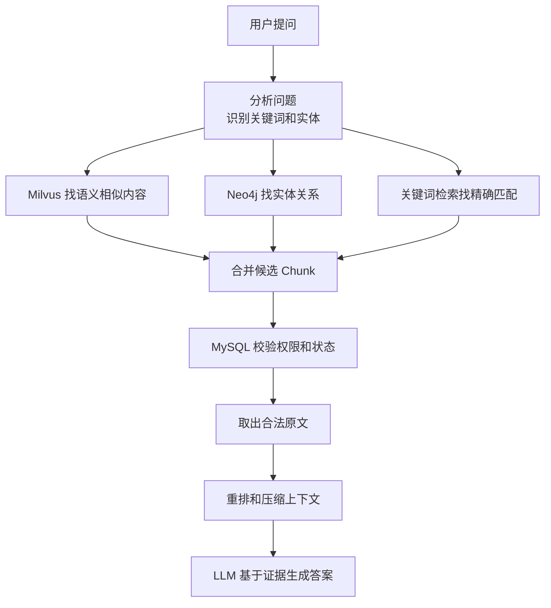

# GraphRAG 企业架构入门版说明

## 1. 这份文档适合谁看

这份文档是给刚接触 RAG、GraphRAG、向量库、知识图谱的技术同学看的。它不会像正式架构设计文档那样展开很多企业级细节，而是先帮你理解：

- 这个系统到底要解决什么问题。
- 为什么需要 MySQL、Milvus、Neo4j 三个数据库。
- 用户提问后，系统是怎么一步步找到资料并生成答案的。
- 为什么企业场景里一定要重视权限、安全和数据一致性。
- 当前项目里的 `kg_ingest.py` 和完整架构之间是什么关系。

如果你已经能看懂这份文档，再去看 `enterprise_architecture_design.md` 会轻松很多。

## 2. 先用一个简单比喻理解

可以把企业知识库想象成一个大型资料室。

| 角色 | 类比 | 在系统里对应什么 |
| :--- | :--- | :--- |
| 资料管理员 | 保存原始资料，知道谁能看、资料是否有效 | MySQL |
| 快速找相似内容的人 | 你描述一句话，他能快速找出意思相近的资料 | Milvus |
| 关系地图管理员 | 知道人、公司、项目、地点之间有什么关系 | Neo4j |
| 总调度员 | 负责把多个来源的结果合并、筛选、交给大模型 | RAG API |
| 写答案的人 | 根据找到的资料组织语言回答用户 | LLM |

所以这个系统不是让大模型凭空回答，而是先从企业资料里找证据，再让大模型基于证据回答。

## 3. RAG 是什么

RAG 的全称是 Retrieval-Augmented Generation，中文可以理解为“检索增强生成”。

普通大模型回答问题时，主要依赖自己训练时学到的知识。但企业内部资料通常是私有的、不断变化的，大模型不一定知道。

RAG 的思路是：

1. 用户提出问题。
2. 系统先去企业知识库里检索相关资料。
3. 把检索到的资料作为上下文交给大模型。
4. 大模型基于这些资料生成答案。

简单说：**先查资料，再回答。**

## 4. GraphRAG 又是什么

普通 RAG 主要靠“相似度”找资料。比如用户问“苹果公司 CEO 的母校是什么”，向量检索可能先找到“蒂姆·库克是苹果公司 CEO”这段话。

但如果另一段资料写的是“蒂姆·库克毕业于奥本大学”，这段话和“苹果公司 CEO”在字面上不一定很像，普通向量检索可能漏掉。

GraphRAG 会额外引入“关系地图”：

- 蒂姆·库克 是 苹果公司 CEO。
- 蒂姆·库克 毕业于 奥本大学。

这样系统就能通过“蒂姆·库克”这个实体，把两段资料连起来。

简单说：**RAG 是查相似资料，GraphRAG 还会顺着关系找资料。**

## 5. 为什么需要三个数据库

很多入门同学会问：为什么不能只用一个数据库？

原因是这三个数据库擅长的事情不一样。

### 5.1 MySQL：负责保存真实业务数据

MySQL 是这个系统里的“真理源”。它负责保存：

- 文档信息。
- 每个文本分块的原文。
- 文档版本。
- 文档是否有效。
- 哪些人或部门有权限看。
- 入库任务状态和审计记录。

企业系统里最重要的一点是：**用户最终能不能看到某段资料，必须由 MySQL 判断。**

Milvus 和 Neo4j 可以帮忙找线索，但不能直接决定用户是否有权限看原文。

### 5.2 Milvus：负责快速查找语义相似内容

Milvus 是向量数据库。

它会把一段文字变成一串数字，也就是向量。意思相近的文字，向量距离通常也比较近。

比如：

- “怎么申请年假”
- “员工休假流程是什么”

这两句话字面不完全一样，但意思很接近。Milvus 就适合找这种“意思相近”的内容。

它的优势是快，适合在大量文本中做语义召回。

### 5.3 Neo4j：负责保存实体和关系

Neo4j 是图数据库，适合保存“点”和“关系”。

比如：

```text
蒂姆·库克 --担任CEO--> 苹果公司
蒂姆·库克 --毕业于--> 奥本大学
苹果公司 --总部位于--> 库比蒂诺
```

在 Neo4j 里，系统可以顺着这些关系找上下文。这就是 GraphRAG 里的“Graph”。

它的优势是多跳推理。比如从“苹果公司”找到“蒂姆·库克”，再找到“奥本大学”。

## 6. 一句话理解三库分工

| 数据库 | 一句话理解 | 主要问题 |
| :--- | :--- | :--- |
| MySQL | 原文和权限的最终裁判 | 这段资料真实存在吗？用户能看吗？ |
| Milvus | 快速找意思相近的内容 | 哪些文本和问题语义相似？ |
| Neo4j | 找实体之间的关系 | 哪些人、公司、项目、概念有关联？ |

它们的关系可以理解为：

```text
Milvus 找相似资料
Neo4j 找关系资料
MySQL 做最终校验并取原文
LLM 根据原文和关系生成答案
```

### 6.1 Milvus 和 Neo4j 是并列还是串联

Milvus 与 Neo4j 不是固定的纯并列或纯串联关系。在线检索时，二者可以作为并列召回源；在 GraphRAG 增强阶段，也可以形成“向量召回 -> 图谱扩展”或“实体直达 -> 向量补充”的串联关系。Neo4j 可承担向量召回能力，但在大规模企业场景下，Milvus 通常作为专用向量引擎独立部署。

## 7. 什么是 Chunk

企业文档通常很长，不能整篇直接塞给大模型，也不适合整篇做向量检索。

所以系统会把文档切成很多小段，每一小段叫一个 Chunk，也就是“文本块”。

比如一份员工手册可以被切成：

- Chunk 1：入职流程。
- Chunk 2：试用期规则。
- Chunk 3：年假申请。
- Chunk 4：离职流程。

每个 Chunk 都有一个唯一编号，叫 `chunk_id`。

`chunk_id` 很重要，因为 MySQL、Milvus、Neo4j 都要靠它对齐同一段内容。

## 8. 文档入库时发生了什么

当一份新文档进入系统时，大致会经过这些步骤：

1. 上传文档。
2. 系统解析文档内容，比如 PDF、Word、网页、表格。
3. 把文档切成多个 Chunk。
4. 把 Chunk 原文、文档版本、权限信息写入 MySQL。
5. 把 Chunk 转成向量，写入 Milvus。
6. 从 Chunk 中抽取实体和关系，写入 Neo4j。
7. 标记这份文档已经可以被检索。

这个过程可以理解为：

```text
原始文档
  -> 切成 Chunk
  -> MySQL 保存原文和权限
  -> Milvus 保存向量
  -> Neo4j 保存实体关系
```

## 9. 用户提问时发生了什么

用户问一个问题后，系统不会马上让大模型回答，而是先检索。

一个典型流程是：

1. 用户提问，比如“苹果公司 CEO 的母校是哪所大学？”
2. 系统分析问题，识别关键词和实体，比如“苹果公司”“CEO”。
3. Milvus 查找语义相似的 Chunk。
4. Neo4j 根据实体关系扩展相关 Chunk。
5. 可选的关键词检索查找精确词，比如合同编号、产品型号、法规条款。
6. 系统把多个来源的候选结果合并、去重、排序。
7. 所有候选 Chunk 都回到 MySQL 做权限和状态校验。
8. 只有用户有权限看的 Chunk，才会被取出原文。
9. 系统把这些原文和关系整理成上下文。
10. 大模型基于上下文生成答案。

重点记住一句话：**任何进入大模型的原文，都必须先通过 MySQL 权限校验。**

## 10. 为什么不能只靠向量检索

向量检索很强，但不是万能的。

它容易遇到这些问题：

- 用户问的是精确编号，向量检索可能不如关键词检索准。
- 用户问的是多跳关系，向量检索可能找不到间接相关资料。
- 用户使用了公司内部简称，向量检索可能理解不准。
- 文档已经下线，但向量库还没来得及删除，可能仍然召回旧内容。

所以企业级系统通常会组合多种方法：

- 向量检索负责“语义相似”。
- 关键词检索负责“精确匹配”。
- 图谱检索负责“关系扩展”。
- MySQL 负责“状态和权限兜底”。

这叫混合检索。

## 11. 为什么权限校验这么重要

企业知识库里可能有不同级别的资料：

- 普通员工手册。
- 部门内部文档。
- 财务数据。
- 法务合同。
- 高管会议纪要。
- 客户隐私信息。

如果系统只看“内容相关”，不看“用户是否有权限”，就可能把不该看的资料交给大模型。大模型一旦看到了，就可能在回答里泄露。

所以正确做法是：

```text
先召回候选资料
再用 MySQL 检查权限
只把合法资料交给大模型
```

尤其要注意：Neo4j 图谱扩展出来的新 Chunk，也必须再次回 MySQL 校验，不能直接使用。

## 12. 为什么要处理数据一致性

三套数据库一起工作，就会出现一个问题：数据可能短时间不同步。

比如：

- MySQL 里文档已经下线。
- Milvus 里对应向量还没删除。
- Neo4j 里对应关系还没清理。

如果系统直接相信 Milvus 或 Neo4j，就可能返回旧资料。

所以架构里的原则是：

- MySQL 是最终可信来源。
- Milvus 和 Neo4j 是辅助索引，可以短时间落后。
- 查询时必须回 MySQL 做最终确认。

这样即使派生索引晚一点更新，也不会把无权限或已下线的原文交给用户。

## 13. Rerank 是什么

第一次检索拿到的结果不一定排序最好。

比如 Milvus 可能返回 100 个候选 Chunk，其中真正最相关的可能排在第 10 位。

Rerank 的意思是“重新排序”。

它会更仔细地比较用户问题和候选 Chunk，把最相关的内容排到前面。

可以理解为：

```text
召回：先把可能相关的资料捞上来
重排：再从里面挑最有用的资料
生成：最后交给大模型回答
```

## 14. 评估这个系统好不好，看什么

不能只看“大模型回答得像不像”。企业级系统要分开看检索和生成。

### 14.1 检索质量

主要看：

- 应该找到的资料有没有找到。
- 找到的资料是否排在前面。
- 有没有把无权限资料放进上下文。
- 有没有漏掉关键词、编号或关系型资料。

### 14.2 生成质量

主要看：

- 回答是否基于证据。
- 有没有编造。
- 引用是否准确。
- 证据不足时是否会拒答。

### 14.3 系统质量

主要看：

- 响应速度。
- 失败率。
- 文档上传后多久能被检索。
- 数据库之间是否经常不一致。
- 权限是否可靠。

## 15. 当前项目代码和完整架构的关系

当前项目里的 `kg_ingest.py` 是一个入门原型，主要验证：

- 如何连接 Neo4j。
- 如何使用大模型抽取实体和关系。
- 如何把知识图谱写入 Neo4j。

它还不是完整企业级 GraphRAG 系统。

当前原型还缺少：

- MySQL 原文和权限存储。
- Milvus 向量检索。
- 用户查询 API。
- 多路召回和重排。
- 权限校验闭环。
- 文档版本和索引状态。
- 监控、审计、失败重试和备份恢复。

所以可以把当前代码理解成：

```text
完整系统中的 Neo4j 图谱入库实验部分
```

而不是完整系统本身。

## 16. 一个最小可行版本应该怎么做

对于入门阶段，不建议一口气做完整企业级系统。可以分三步走。

### 第一步：跑通 Neo4j 图谱抽取

目标：

- 输入一段文本。
- 抽取实体和关系。
- 写入 Neo4j。
- 能在 Neo4j Browser 里看到图。

当前 `kg_ingest.py` 就是在做这件事。

### 第二步：加上原文存储和权限校验

目标：

- 用 MySQL 保存文档和 Chunk 原文。
- 每个 Chunk 有 `chunk_id`。
- 查询结果必须回 MySQL 检查状态和权限。

这一步能让系统从“实验 demo”走向“可控业务系统”。

### 第三步：加上向量检索和混合召回

目标：

- 把 Chunk 转成 embedding。
- 写入 Milvus。
- 用户提问时同时走向量召回和图谱召回。
- 合并、重排、校验权限后再交给大模型。

这一步才比较接近完整 GraphRAG。

## 17. 常见误区

### 17.1 误区一：有了大模型就不需要数据库

不对。大模型负责生成语言，数据库负责保存事实、权限、版本和证据。

### 17.2 误区二：有了向量库就等于 RAG

不对。向量库只是 RAG 的一部分。完整 RAG 还需要文档处理、权限校验、重排、引用、评估和监控。

### 17.3 误区三：GraphRAG 就是把 Neo4j 接上

不对。GraphRAG 的关键是让实体关系参与召回和上下文构造，而不是简单存一张图。

### 17.4 误区四：图谱扩展出来的资料可以直接给大模型

不对。图谱扩展出来的 Chunk 也必须回 MySQL 校验权限。

### 17.5 误区五：检索结果越多越好

不对。太多无关上下文会干扰大模型，还会增加成本。应该召回足够多，再重排和压缩。

## 18. 术语速查

| 术语 | 简单解释 |
| :--- | :--- |
| RAG | 先检索资料，再让大模型回答 |
| GraphRAG | 在 RAG 中加入实体关系和图谱扩展 |
| Chunk | 文档切出来的小文本块 |
| `chunk_id` | 每个 Chunk 的唯一编号 |
| Embedding | 把文字转换成数字向量 |
| 向量检索 | 根据语义相似度找文本 |
| Milvus | 专门做向量检索的数据库 |
| Neo4j | 专门保存实体关系的图数据库 |
| MySQL | 保存原文、权限、状态和业务数据的数据库 |
| 实体 | 人、公司、地点、项目、概念等对象 |
| 关系 | 实体之间的连接，比如“任职于”“位于”“属于” |
| Rerank | 对召回结果重新排序 |
| ACL | 权限控制列表，说明谁能看什么 |
| Outbox | 一种可靠投递异步任务的设计方式 |
| CDC | 捕获数据库变更并同步给其他系统 |

## 19. 最后用一张流程图记住它



记住这条主线就够了：

```text
提问 -> 多路检索 -> MySQL 鉴权 -> 取合法原文 -> 大模型回答
```

企业级 GraphRAG 的核心不是“用了几个数据库”，而是让每个数据库做自己最擅长的事，同时保证安全、可控、可追踪。
